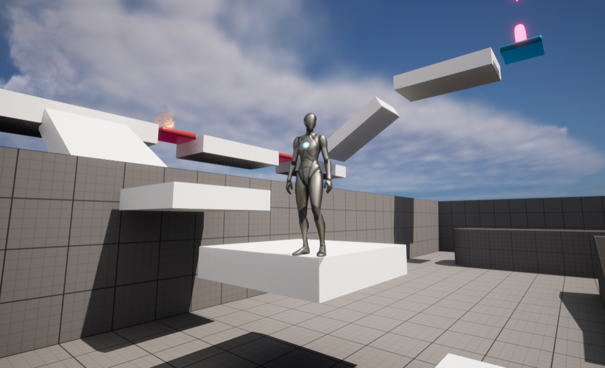
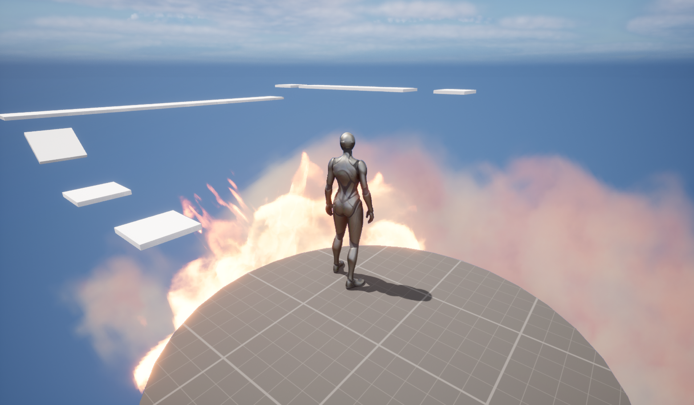

# 단축키 

- 액터 확대 보기 = 액터 선택 + F  
 
 - 뷰포트 카메라 이동 = 우측 클릭 + W A S D (Q E 는 높이)  

- 트랜스폼 변경  
>이동 w  
>회전 e  
>스케일 r 
>액터 바닥에 붙이기 END  
  
  - 마우스 커서 보기 Shift + F1

-  이동 모드에서 액터 복제 : Alt + 마우스 왼쪽 버튼 드래그   
 
 - 아웃라이너 패널에서 다중 액터 선택 SHift 또는 ctrl + 다중 액터 클릭  

 
 - 콘텐츠 브라우저 불러오기 Ctrl + Space

- 액트명 변경 F2  
 
 뷰포트 시점 변경:  
 원근 Alt + G  
 정면 Alt + H  
 상단 Alt + J  
왼쪽 Alt + K   

- 마우스 치수 제기 마우스 중간 키  

# 1주차 강의 실습

  
 
 
 

 
 
 

 
 
 