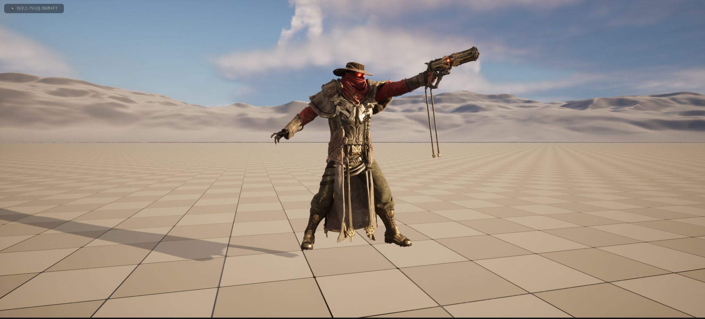

# Unreal C++ Game Project 
> Unreal5 C++ 학습을 위한 게임 프로젝트

# 패치노트
- 08.14  
캐릭터 추가  
캐릭터 걷기 및 뛰기 추가

- 08.16  
캐릭터 코드 대규모 변경  
캐릭터 점프 추가

# 코드 및 사진
>08.14
- 캐릭터 코드
```c++

// Fill out your copyright notice in the Description page of Project Settings.
#include "MyCharacter.h"

// Sets default values
AMyCharacter::AMyCharacter()
{
	PrimaryActorTick.bCanEverTick = true;
}

// Called when the game starts or when spawned
void AMyCharacter::BeginPlay()
{
	Super::BeginPlay();
}

// Called every frame
void AMyCharacter::Tick(float DeltaTime)
{
	Super::Tick(DeltaTime);

}

// 이 부분이 캐릭터의 입력값을 받는 부분
void AMyCharacter::SetupPlayerInputComponent(UInputComponent* PlayerInputComponent)
{
	Super::SetupPlayerInputComponent(PlayerInputComponent);

	PlayerInputComponent->BindAxis(TEXT("MoveFB") , this ,&AMyCharacter::MoveForWard);
	PlayerInputComponent->BindAxis(TEXT("MoveRL") , this ,&AMyCharacter::MoveRight);
}

void AMyCharacter::MoveForWard(float axisvalue)
{
	if(axisvalue == 0 )
		return;
	
	FVector Direction = FRotationMatrix(Controller->GetControlRotation()).GetScaledAxis(EAxis::X);
	AddMovementInput(Direction, axisvalue);
	
}

void AMyCharacter::MoveRight(float axisvalue)
{
	if(axisvalue == 0)
		return;
	
	FVector Direction = FRotationMatrix(Controller->GetControlRotation()).GetScaledAxis(EAxis::Y);
	Controller->GetPawn()->AddMovementInput(Direction, axisvalue);
}
```

<br>


<br>
   
> 08.16
- 캐릭터 코드
```c++
// Fill out your copyright notice in the Description page of Project Settings.
#include "MyCharacter.h"
#include "Camera/CameraComponent.h"
#include "Components/CapsuleComponent.h"
#include "GameFramework/CharacterMovementComponent.h"
#include "GameFramework/SpringArmComponent.h"

// Sets default values
AMyCharacter::AMyCharacter()
{
	PrimaryActorTick.bCanEverTick = true;
	GetCapsuleComponent()->InitCapsuleSize(35.0f , 130.0f);

	bUseControllerRotationPitch = false;
	bUseControllerRotationRoll = false;
	bUseControllerRotationYaw = false;

	GetCharacterMovement()->bOrientRotationToMovement = true;
	GetCharacterMovement()->RotationRate = FRotator(0.0f , 500.0f , 0.0f);
	GetCharacterMovement()->JumpZVelocity = 700.0f;
	GetCharacterMovement()->AirControl = 0.35f;
	GetCharacterMovement()->MaxWalkSpeed = 500.f;
	GetCharacterMovement()->MinAnalogWalkSpeed = 20.f;
	GetCharacterMovement()->BrakingDecelerationWalking = 2000.f;

	SpringArm = CreateDefaultSubobject<USpringArmComponent>(TEXT("SpringArm"));
	SpringArm->SetupAttachment(RootComponent);
	SpringArm->TargetArmLength = 400.0f;
	SpringArm->bUsePawnControlRotation = true;

	Camera = CreateDefaultSubobject<UCameraComponent>(TEXT("camera"));
	Camera->SetupAttachment(SpringArm , USpringArmComponent::SocketName);
	Camera->bUsePawnControlRotation =false;
}

// Called when the game starts or when spawned
void AMyCharacter::BeginPlay()
{
	Super::BeginPlay();
}

// Called every frame
void AMyCharacter::Tick(float DeltaTime)
{
	Super::Tick(DeltaTime);

}

// Called to bind functionality to input
void AMyCharacter::SetupPlayerInputComponent(UInputComponent* PlayerInputComponent)
{
	Super::SetupPlayerInputComponent(PlayerInputComponent);

	PlayerInputComponent->BindAxis(TEXT("Move Forward / Backward") , this ,&AMyCharacter::MoveForWard);
	PlayerInputComponent->BindAxis(TEXT("Move Right / Left") , this ,&AMyCharacter::MoveRight);
	
	PlayerInputComponent->BindAxis(TEXT("Mouse Right / Left") , this , &APawn::AddControllerYawInput);
	PlayerInputComponent->BindAxis(TEXT("Mouse Up / Down") , this , &APawn::AddControllerPitchInput);

	PlayerInputComponent->BindAction(TEXT("Jump") , IE_Pressed , this , &ACharacter::Jump);
	PlayerInputComponent->BindAction(TEXT("Jump") , IE_Released , this , &ACharacter::StopJumping);
}

void AMyCharacter::MoveForWard(float axisvalue)
{
	if((Controller == nullptr) || (axisvalue == 0.0f) )
		return;

	const FRotator Rotation = Controller->GetControlRotation();
	const FRotator YawRotation(0 , Rotation.Yaw , 0);
	
	FVector Direction = FRotationMatrix(YawRotation).GetUnitAxis(EAxis::X);
	AddMovementInput(Direction, axisvalue);
	
}

void AMyCharacter::MoveRight(float axisvalue)
{
	if((Controller == nullptr) || (axisvalue == 0.0f) )
		return;

	const FRotator Rotation = Controller->GetControlRotation();
	const FRotator YawRotation(0 , Rotation.Yaw , 0);
	
	FVector Direction = FRotationMatrix(Controller->GetControlRotation()).GetScaledAxis(EAxis::Y);
	Controller->GetPawn()->AddMovementInput(Direction, axisvalue);
}
```
<br>

<br>  