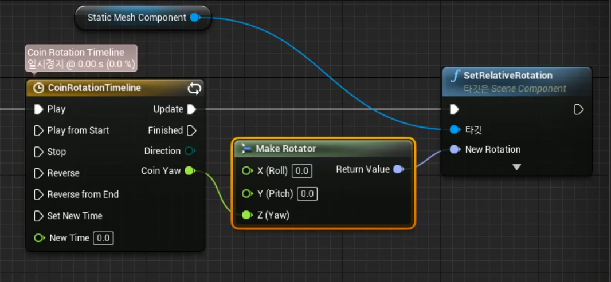
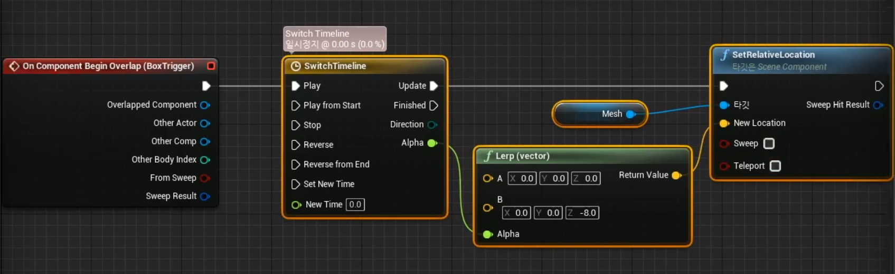

# 타임라인을 사용한 액터 및 컴포넌트 이동
> 시간에 맞춰 같은 움직임을 반복적으로 보여주는 것들
    
### 타임라인
> 정해진 시간에 정해진 대로 영상을 변화시키기 위한 기능

시간의 경과에 따른 값의 변화를 곡선으로 표현
* x축: 시간
* y축: 값
* 트랙의 종류: float, vector, color, event

곡선 입력
* Key=(time, value)
* 키 추가: shift + 좌클릭
* 키 사이를 보간하여 곡선 생성 

### 타임라인 구현

Float 트랙
> 1초에 1회전 = 1초의 타임라인에서 float 값을 0에서 360으로 변화

타임라인 노드
* update 출력 실행 핀: 타임라인 재생 동안에 계속 실행
* Finished 출력 실행 핀: 타임라인 재생이 끝나면 실행

### 회전의 구현

Make Rotator
> 3개의 float 값(Roll, Pitch, Yaw)으로 부터 Rotator 구조체를 만들어줌
 * 반대 기능: BreakRotator

SetRelativeRotation
> 부모 컴포넌트에 상대적인 회전을 지정

Lerp(Linear Interpolation)
> 두 지점 사이의 값을 선형 보간

Arrow 컴포넌트
> 에디터에서만 보임 
 * 액터의 방향을 쉽게 파악할 수 있도록 도와줌

SetRelativeLocation
> 부모 컴포넌트의 상대적인 위치를 지정함

1. BeginPlay 이벤트에 타임라인 추가 후 연결 
2. 타임라인 에디터에서 길이(초) 수정 후 루프 check(계속 반복할 경우) 
3. float 트랙 추가 (shift + 좌클릭으로 key frame 추가)
4. Static Mesh Component를 드래그하여 블루프린트 에디터 안으로 배치 후 SetRelativeRotation 액션 호출 후 타깃에 연결
5. SetRelativeRotation의 New Rotation에 Make Rotator 연결 

 

### Coin의 Timeline을 통한 Yaw회전 

 

### Button timeline 

 

* 선형 보간: key frame 우 클릭 -> 키 보간 -> 자동
* 선형 보간을 위해서 Lerp 함수 호출 후 timeline에 연결
* BoxTrigger의 On Component Begin Overlap 이벤트 호출 후 타임라인에 연결

 

### Gate Timeline

 

* vetocr 트랙 추가 
* X, Y, Z 축에 따른 key frame 설정 후 선형 보간
* timeline과 SetRelativeLocation을 연결 
* vector x vector 함수를 사용하여 y축에 -1을 곱해 반대쪽 액션도 추가 

 

