# Intro to Unreal Engine C++

## 클래스 상속

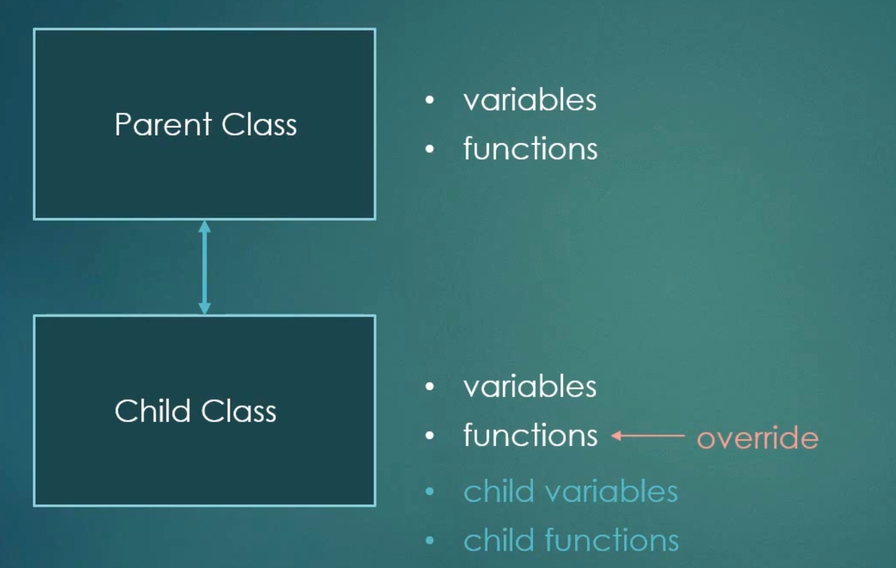  

<br>

부모클래스는 자신의 변수와 함수를 가지며 부모클래스를 상속받은 자식클래스는 자신만의 변수와 함수를 가지며 추가적으로 부모클래스의 변수와 함수를 가진다.
> 이 때 자식클래스는 부모클래스의 함수를 `override`하여 사용한다


<br><br><br>

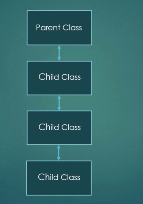  

<br><br>

```cpp
#include <iostream>

using namespace std;

class Shpae{
public:
    Shape();
    virtual void draw() const =0;  // pure virtual function
protected:
    char color[3];
}

class Rectangle : public Shape{
public:
    void draw() const;
    int width, height;
}

class Circle : public Shape{
public:
    void draw() const;
    double radius;
}
```


위 그림처럼 상속이 연속으로 이루어진 것을 `계승 계층(inheritance hierachy)` 이라고 불린다.

<br><br><br>

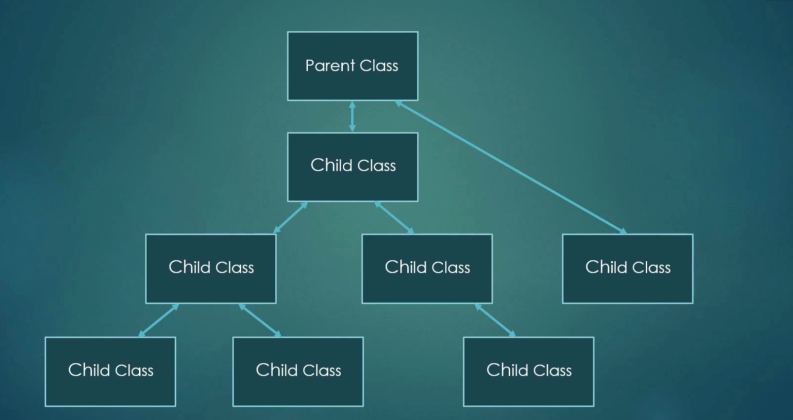  

또한 계승 계층은 다수의 자식 클래스를 같은 부모 클래스로 부터 파생시킬 수 있다.

자식 클래스는 다수의 부모 클래스를 상속할 수 있으며 각각의 변수와 함수또한 상속된다.
> 이것을 `다형성(Polymorphism)` 이라고 한다

<br><br>

  

부모 클래스는 parent의 포인터 형식으로 가르키며 자식 클래스 또한 가르킬 수 있다 
> 이것을 `업 캐스팅(UpCasting)` 이라고 한다.

<br><br>


## Unreal Engine Hierarchy


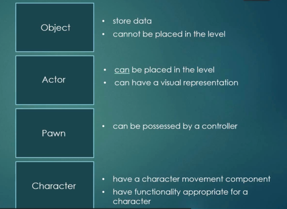  

<br>


> ### Object
> * 데이터를 저장
> * 레벨에 배치 불가능
> ### Actor
> * 레벨에 배치 가능
> * 시각적인 표현 가능
> ### Pawn
> * 컨트롤러가 소유 가능
> ### Character
> * 캐릭터 움직임 컴포넌트를 소유
> * 캐릭터에 적합한 기능을 보유

### ***상속관계 이기 때문에 하위 클래스는 상위 클래스의 속성을 모두 포함한다***

<br>


## is a 관계

<br>

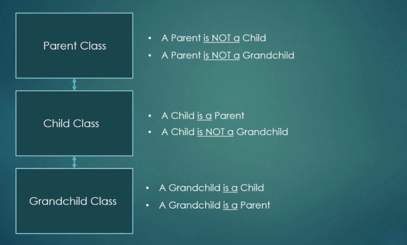  

자식 클래스는 부모 클래스 이지만, 부모 클래스는 자식 클래스가 아니다.


<br><br><br>

## 언리얼 클래스

<br>

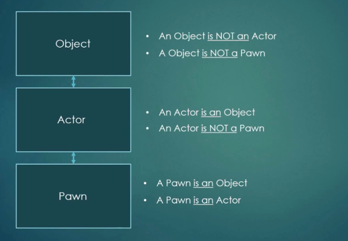  

1. 오브젝트는 액터, 폰이 아니다
2. 액터는 폰이 아니다
3. 액터는 오브젝트이다
4. 폰은 오브젝트이다
5. 폰은 액터이다


<br><br<br>


## has a 관계

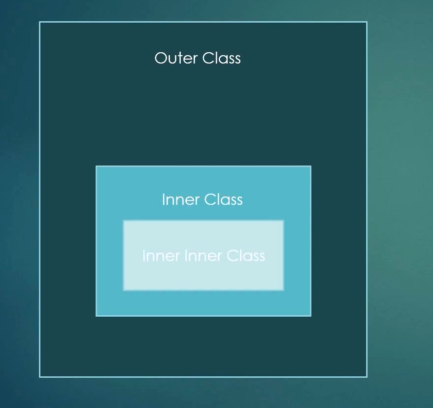  

### Outer class는 inner class를 가진다.

<br><br><br>

## 언리얼 클래스

<br>

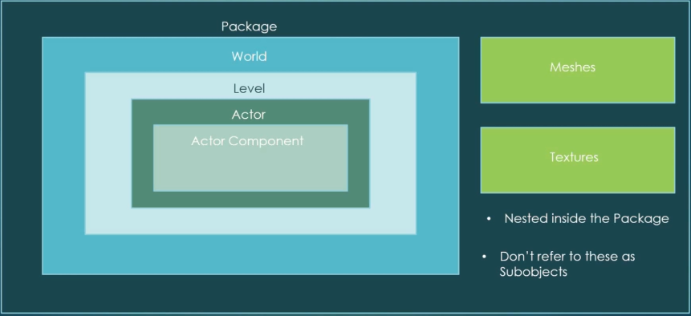  

1. 패키지는 월드를 가진다 / 월드는 패키지의 `서브객체(SubObject)`이다.
2. 월드는 레벨을 가진다 / 레벨은 월드의 서브객체이다
3. 레벨은 액터를 가진다 / 액터는 레벨의 서브객체이다
4. 액터는 컴포넌트를 가진다 / 컴포넌트는 액터의 서브객체이다
5. 매쉬와 텍스쳐는 패키지 내부에 중첩되어 있다.
> 이것들은 서브객체가 아니다


<br><br>

## Reflection

### Reflection은 프로그램이 런타임에 자신을 검사할 수 있는 기능이다
> c++ 에는 reflection 시스템이 없고 언리얼 엔진에서만 제공한다. 

또한 이 시스템은 c++ 데이터를 Unreal Editer 시스템과 합쳐 blueprint에 나타내는 역할을 하고 Garbage Collection 기능을 수행한다.
> Garbage collection은 프로그램이 프로젝트와 관련된 메모리를 관리하고 자동으로 삭제한다.

<br>

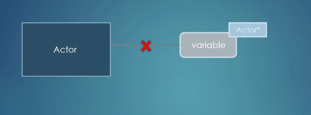  

시스템은 객체가 더 이상 참조되지 않을 때 변수를 자동으로 삭제한다.

<br><br>

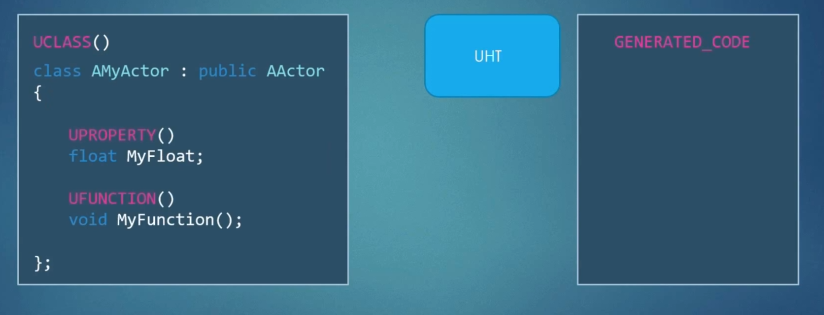  

UCLASS, UPROPERTY, UFUNCTION 매크로는 reflection에 대한 각각의 클래스, 변수, 함수를 표시한다.

<br><br><br>


## Using UObject in Blueprints

### MyObject.h
``` cpp
#pragma once

#include "CoreMinimal.h"
#include "UObject/NoExportTypes.h"
#include "MyObject.generated.h"

UCLASS(Blueprintable, BlueprintType)
class FIRSTPROJECT_API UMyObject : public UObject
{
    GENERATED_BODY()
public:
    UMyObject();

    UPROPERTY(BlueprintReadOnly, Category="MyVariables")
    float MyFloat;

    UFUNCTION(BlueprintCallable, Category="MyFunctions")
    void MyFunction();
}
```
### MyObject.cpp
```cpp
#include "MyObject.h"
UMyObject::UMyObject()
{
    MyFloat=0;
}

void UMyObject::MyFunction()
{
    UE_LOG(LogTemp, Warning, TEXT("this is our warnging text"));
}
```

<br><br>


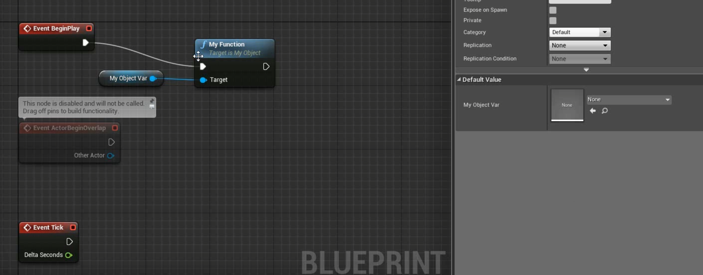  

### Default Value 값이 None이기 때문에 property를 읽어올 수 없다는 에러가 발생한다 
> None이라는 뜻은 C++에서 NULL pointer라는 뜻이다 

<br><br>

### 따라서 변수 초기화를 위해 새로운 오브젝트를 생성해야한다 
> Blueprint에서 Construct라는 초기화 객체가 존재한다


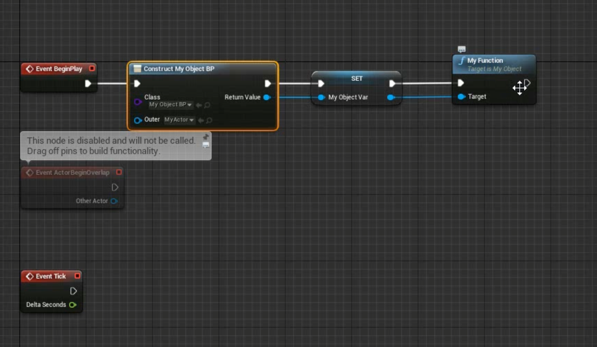  


Construct의 Class를 나의 Blueprint 클래스, Outer를 상위 객체인 MyActor로 설정한 노드를 Set 오브젝트로 연결하면 변수 초기화가 진행된다. 이후 MyFunction 오브젝트와 연결하면 오류없이 작동하는 것을 볼 수 있다.